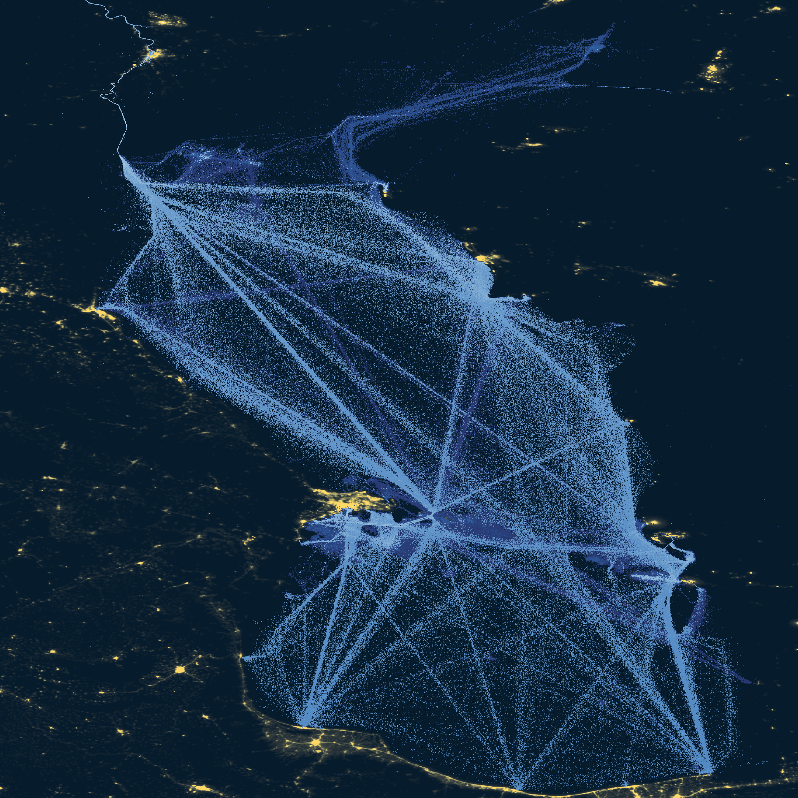

I have compiled a map of shipping in the Caspian Sea 🇰🇿 🇦🇿 🇹🇲 🇮🇷 🇷🇺

The Caspian Sea is not just a body of water, it is an important economic resource. New navigation visualizations developed by me in the R language using the tidyverse, terra, sf, giscoR and ggnewscale libraries.

The navigation map can help us better understand the Caspian Sea, which will allow us to:

• Optimize the transportation of oil and other goods between the Caspian countries, increasing the efficiency and profitability of transportation ⛽ 

• Ensure the safety of navigation in the Caspian region, reducing the risks of accidents and environmental pollution 🦈 

• To develop sustainable tourism on the coasts of the Caspian countries, preserving the fragile ecosystem of the Caspian Sea ⛴️

• Strengthen regional cooperation in the field of shipping, oil and gas industry and other areas between the Caspian countries ⚓️
